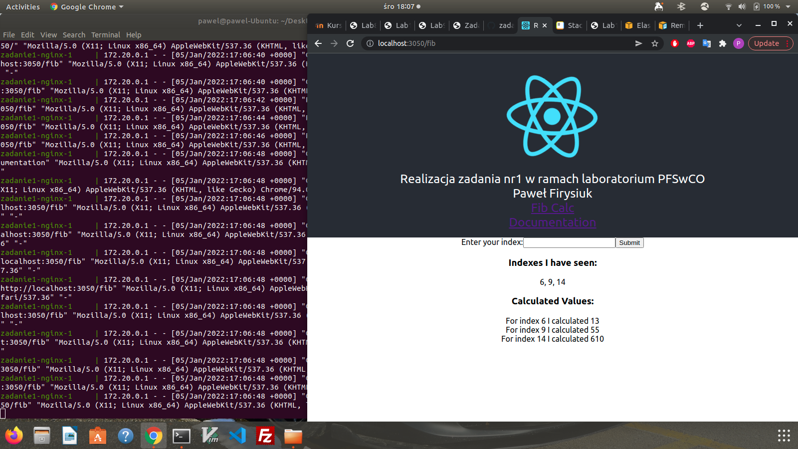
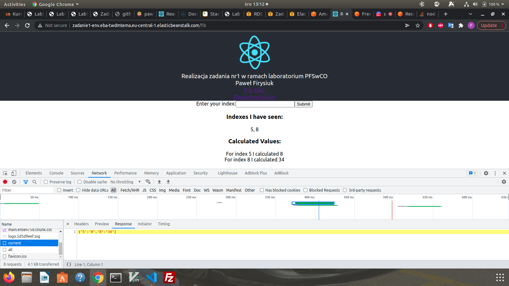

# Zadanie 1

Architektura aplikacji pochodzi z lab 9 i nie została zmieniona. 

Wersję dev usługi uruchamiamy poleceniem:
```
docker compose -f docker-compose.dev.yml up
```

Uruchomiona i działająca aplikacja:


Usługa została wdrożona na AWS Elastic Beanstalk, Amazon Relational Database Service (RDS) oraz AWS ElastiCache.
Działająca, wzrożona aplikacja:

